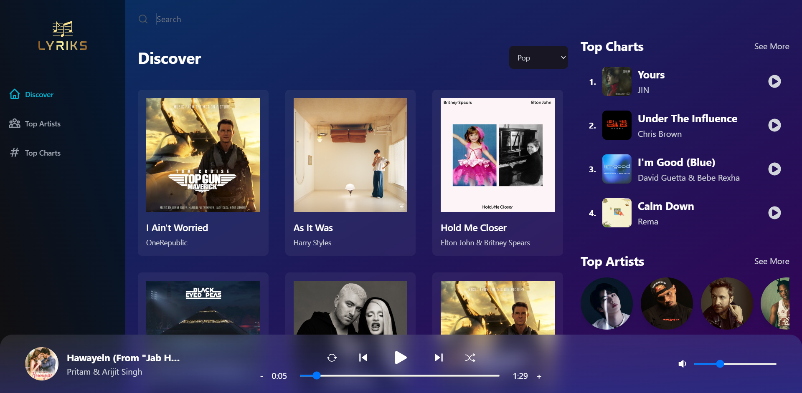

# Lyriks-A Music App

This is a fully-functional and Responsive music streaming app made using React.Js,,React-Route,Redux,Tailwind CSS and Vite.

#### Live Site: (https://lyriks-music-app.netlify.app/)[https://lyriks-music-app.netlify.app/]

## Table of contents

- [Lyriks-A Music App](#lyriks-a-music-app)
      - [Live Site: (https://lyriks-music-app.netlify.app/)[https://lyriks-music-app.netlify.app/]](#live-site-httpslyriks-music-appnetlifyapphttpslyriks-music-appnetlifyapp)
  - [Table of contents](#table-of-contents)
    - [Screenshot](#screenshot)
    - [Built with](#built-with)
    - [Possible Fututre Updates](#possible-fututre-updates)
  - [Author](#author)

### Screenshot

### Built with

- React
- React Router
- Redux
- Tailwind CSS
- Mobile-first workflow
- [React](https://reactjs.org/) - JS library

### Possible Fututre Updates

- Adding New Sections
- Implementing Playlists Functionalitiy
- Implementing Favourite Songs Functionality
- Adding Real-Time Lyrics
- Improving the UI/UX Further

## Author

- Website - [Arnav Thakur](https://github.com/Arnavthakur26)
